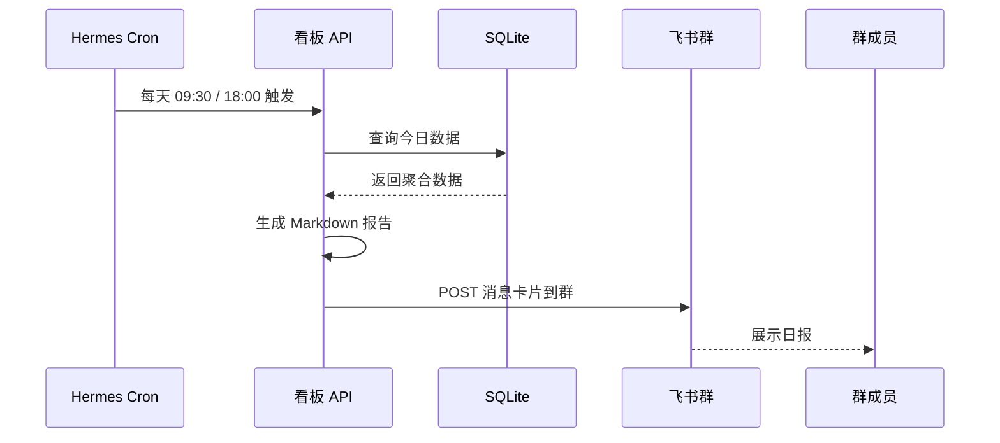

# 晴天项目看板 · 生产级系统方案

**作者：** 童七七（产品经理 / 方案设计专家）
**日期：** 2026-07-01
**版本：** v1.0
**状态：** 草案待审

---

> **背景：** 晴天项目看板当前为 MPA 多页面 HTML 原型（v2），使用 localStorage 做数据持久化，已实现完整 CRUD 和 3 个 P0 修复，测试覆盖率 72/86 条通过。本次方案旨在将原型升级为**生产级系统**，支持 6 个 Hermes Agent 协作、飞书群自动同步、数据持久化、多人并发访问。

---

## 1. 技术架构

### 1.1 前端方案

**推荐：保持 MPA 架构 → 渐进式升级为 SPA**

#### 现状评估

| 维度 | 当前 v2 原型 | 评价 |
|------|-------------|------|
| 页面数 | index.html / dashboard.html / projects.html / project-detail.html + data.js | 4 个 MPA 页面 + 1 个共享数据层 |
| 数据层 | localStorage + data.js CRUD 函数 | 单机可用，无后端 |
| 用户管理 | 硬编码 demo@qingtian.com / 123456 | 仅演示 |
| 状态管理 | 全局 `DATA` 对象 | 页间切换需重新加载 |

#### 升级路径

```
阶段 1（MVP）：保留 MPA 架构，替换数据源
  ├─ 保持现有 4 个 HTML 页面结构
  ├─ data.js 中的 CRUD 从 localStorage 改为 axios/fetch 调用后端 API
  ├─ 新增登录 SDK（飞书身份认证 或 JWT）
  └─ 新增共享布局组件（侧边栏/顶栏改为 include 或 EJS 模板）

阶段 2（增强）：引入 Vue 3 或 React 轻量 SPA
  ├─ 保留 MPA 作为维护模式，SPA 版并行开发
  ├─ 使用 Vite + React（或 Vue 3）+ TypeScript
  ├─ 状态管理用 Zustand（React）或 Pinia（Vue）
  ├─ 路由用 React Router / Vue Router
  └─ 组件库用 Ant Design (React) 或 Element Plus (Vue)

阶段 3（长期）：可评估微信小程序版本
  └─ 若需要移动端随时随地查看，可基于同一套 API 出小程序版
```

**推荐策略：** 阶段 1 优先（2 周内上线 MVP），阶段 2 根据用户反馈决定是否 SPA 化。**不推荐一开始就做小程序**——当前看板是团队内部工具，桌面端优先。

---

### 1.2 后端方案

#### 方案 A：Node.js + SQLite（推荐 ✅）

| 维度 | 说明 |
|------|------|
| 框架 | Express.js / Fastify |
| 数据库 | SQLite（better-sqlite3）—— 零运维，单文件，适合 6 人团队 |
| ORM | Drizzle ORM 或 Prisma（类型安全 + 迁移管理） |
| 部署 | 与 Hermes Agent 同机部署，pm2 进程守护 |
| 认证 | JWT（jsonwebtoken），支持飞书 OAuth 联合登录 |
| API 风格 | RESTful JSON API |
| 端口 | 3001（独立于 Hermes 的端口） |

**优点：**
- 部署极简——没有数据库服务器，没有容器编排
- 6 人并发完全够用（SQLite WAL 模式支持读写并发）
- 与 Hermes Agent 同一台 Mac，飞书 webhook 直接本地调用
- 开发/调试成本最低

**缺点：**
- 不支持水平扩展（6 人团队不需要）
- 无内置权限系统（需要自己写 ACL）

#### 方案 B：微信云开发

| 维度 | 说明 |
|------|------|
| 数据库 | 微信云数据库（MongoDB-like） |
| 计算 | 云函数（Node.js 运行时） |
| 部署 | 微信开发者工具一键部署 |
| 认证 | 微信登录自动集成 |
| 优势 | 穗穗念已验证的技术栈，云函数+云数据库开箱即用 |

**优点：**
- 穗穗念项目已验证可靠性
- 免运维，腾讯托管
- 天然支持微信生态

**缺点：**
- 必须绑定微信小程序——纯 Web 端无法直接使用
- 云函数 10 秒超时限制对复杂业务不利
- 无法与 Hermes Agent 本地文件系统交互
- 飞书集成需要额外中转层

#### 方案 C：Node.js + PostgreSQL（远期）

如果需要更强大的查询能力（全文搜索、复杂统计报表），可升级到 PostgreSQL + Supabase 或 Neon（serverless PostgreSQL）。

---

### 1.3 数据持久化方案

#### 核心数据模型

```sql
-- 用户
TABLE users (
  id           TEXT PRIMARY KEY,      -- open_id or UUID
  name         TEXT NOT NULL,
  avatar_url   TEXT,
  role         TEXT DEFAULT 'member', -- admin / member / viewer
  feishu_id    TEXT UNIQUE,
  created_at   TEXT DEFAULT (datetime('now'))
);

-- 项目
TABLE projects (
  id           TEXT PRIMARY KEY,
  name         TEXT NOT NULL,
  description  TEXT,
  color        TEXT DEFAULT '#4F46E5',
  owner_id     TEXT REFERENCES users(id),
  created_at   TEXT DEFAULT (datetime('now')),
  updated_at   TEXT DEFAULT (datetime('now'))
);

-- 项目成员
TABLE project_members (
  project_id   TEXT REFERENCES projects(id),
  user_id      TEXT REFERENCES users(id),
  role         TEXT DEFAULT 'member', -- owner / member / viewer
  PRIMARY KEY (project_id, user_id)
);

-- 任务
TABLE tasks (
  id           TEXT PRIMARY KEY,
  project_id   TEXT REFERENCES projects(id),
  title        TEXT NOT NULL,
  description  TEXT,
  status       TEXT DEFAULT 'todo',   -- todo / in_progress / done / blocked
  priority     TEXT DEFAULT 'medium', -- high / medium / low
  assignee_id  TEXT REFERENCES users(id),
  creator_id   TEXT REFERENCES users(id),
  due_date     TEXT,
  sort_order   INTEGER DEFAULT 0,
  feishu_msg_id TEXT,                 -- 关联的飞书消息 ID
  feishu_thread_id TEXT,              -- 关联的飞书话题 ID
  created_at   TEXT DEFAULT (datetime('now')),
  updated_at   TEXT DEFAULT (datetime('now'))
);

-- 任务评论
TABLE comments (
  id           TEXT PRIMARY KEY,
  task_id      TEXT REFERENCES tasks(id),
  user_id      TEXT REFERENCES users(id),
  content      TEXT NOT NULL,
  created_at   TEXT DEFAULT (datetime('now'))
);

-- 活动日志（审计/通知用）
TABLE activity_log (
  id           TEXT PRIMARY KEY,
  entity_type  TEXT,                  -- task / project / comment
  entity_id    TEXT,
  action       TEXT,                  -- created / updated / status_changed / comment_added
  actor_id     TEXT REFERENCES users(id),
  old_value    TEXT,
  new_value    TEXT,
  created_at   TEXT DEFAULT (datetime('now'))
);
```

#### 持久化策略

| 层级 | 技术 | 说明 |
|------|------|------|
| 主数据库 | SQLite (WAL 模式) | 所有业务数据：用户、项目、任务、评论、活动日志 |
| 缓存 | Hermes `team-space.md` 文件 | 人类可读的看板摘要，每 5 分钟同步一次 |
| 日志 | Hermes session DB | 每次 Agent 操作都会在 Hermes 的 SQLite session 存储中记录 |
| 备份 | cron 定时 `cp` + 飞书群每日备份推送 | 每天凌晨 3 点备份到指定目录 |

#### API 设计原则

```
Base URL: http://localhost:3001/api/v1

通用约定:
  ✅ RESTful: GET/POST/PUT/PATCH/DELETE
  ✅ JSON 请求/响应
  ✅ JWT Bearer Token 认证 (Authorization: Bearer <token>)
  ✅ 统一错误格式: { error: { code, message, details } }
  ✅ 分页: ?page=1&page_size=20 → { data: [...], total, page, page_size }
  ✅ 排序: ?sort=created_at&order=desc
  ✅ 筛选: ?status=todo&assignee_id=xxx
  ✅ 版本前缀: /api/v1/

核心端点:
  POST   /api/v1/auth/login          # 登录（JWT）
  POST   /api/v1/auth/feishu         # 飞书 OAuth 登录
  
  GET    /api/v1/projects            # 列表
  POST   /api/v1/projects            # 创建
  GET    /api/v1/projects/:id        # 详情
  PATCH  /api/v1/projects/:id        # 更新
  DELETE /api/v1/projects/:id        # 删除

  GET    /api/v1/projects/:pid/tasks        # 项目任务列表
  POST   /api/v1/projects/:pid/tasks        # 创建任务
  GET    /api/v1/tasks/:id                  # 任务详情
  PATCH  /api/v1/tasks/:id                  # 更新任务
  DELETE /api/v1/tasks/:id                  # 删除任务
  PATCH  /api/v1/tasks/:id/status           # 切换状态

  GET    /api/v1/tasks/:id/comments         # 评论列表
  POST   /api/v1/tasks/:id/comments         # 添加评论
  DELETE /api/v1/comments/:id               # 删除评论

  POST   /api/v1/feishu/webhook             # 飞书消息 webhook 入口
  POST   /api/v1/feishu/send                # 发送飞书消息（内部）

  GET    /api/v1/activity                    # 活动日志

文件结构:
  server/
  ├── index.js               # 入口
  ├── db/
  │   ├── schema.sql         # 表结构
  │   ├── seed.sql           # 种子数据
  │   └── index.js           # 数据库初始化 + 连接
  ├── routes/
  │   ├── auth.js
  │   ├── projects.js
  │   ├── tasks.js
  │   ├── comments.js
  │   └── feishu.js
  ├── middleware/
  │   ├── auth.js            # JWT 验证
  │   └── logger.js          # 请求日志
  └── services/
      ├── feishu.js          # 飞书 API 封装
      └── sync.js            # team-space.md 同步服务
```

---

## 2. 飞书自动同步功能

### 2.1 用户在飞书群里说话的自动流转

#### 完整流程

```
用户在飞书群发言
    │
    ▼
Hermes Gateway 飞书 Webhook 接收
    │
    ▼
蒋小花（Project Manager Agent）解析消息
    ├─ 判断是否为任务相关（关键词：任务/需求/bug/做/搞/安排等）
    ├─ 判断是否已有任务的讨论
    │     ├─ 有 → 归类为已有任务的评论/状态更新
    │     └─ 无 → 自动创建新任务
    │
    ▼
POST /api/v1/feishu/webhook
    ├─ 自动创建任务（标题来自用户第一句话）
    ├─ 分配负责人（基于话题提及 @Agent 名称）
    ├─ 设置优先级（基于关键词：紧急/重要/尽快 → high）
    └─ 回复飞书群：已创建任务 T-NNN「xxx」
```

**关键设计：**

1. **蒋小花作为调度中心**——所有飞书群消息先进入蒋小花的处理管道
2. **关键词自动分类：**
   - `@赵工`、`@二哥` → 自动分配负责人
   - `紧急`、`P0`、`立刻` → 优先级 high
   - `bug`、`问题`、`坏了` → 类型 bug，state=in_progress
   - `安排`、`做一下`、`搞一下` → 类型 task，state=todo
3. **话题相关性判断：** 如果消息是回复已有飞书消息（有父消息），自动归类为已有任务的评论
4. **确认互动：** 如果匹配度 < 80%，蒋小花回复确认：「已为你创建任务『xxx』，对吗？回复 Y 确认/N 取消」

#### 技术实现

```javascript
// 飞书 webhook 处理伪代码
async function handleFeishuMessage(event) {
  const { text, sender, parent_id, chat_id } = event;

  // 1. 检查是否为已有关联任务
  const existingTask = await findTaskByFeishuMsg(parent_id);
  
  if (existingTask) {
    // 已有任务 → 添加为评论
    const comment = await createComment(existingTask.id, sender, text);
    await syncToTeamSpace();
    return;
  }

  // 2. 检查是否为任务关键词
  const intent = classifyIntent(text);
  if (!intent.isTask) return; // 非任务消息，忽略

  // 3. 自动创建任务
  const task = await createTask({
    title: intent.title,
    priority: intent.priority,
    assignee: intent.assignee,  // @某人 或自动分配
    feishu_msg_id: event.msg_id,
    feishu_thread_id: parent_id,
  });

  // 4. 回复飞书群
  await sendFeishuMessage(chat_id, 
    `✅ 已创建任务 **${task.id}**：${task.title}\n` +
    `📋 状态：${statusLabel(task.status)}\n` +
    `👤 负责人：${task.assignee_name}\n` +
    `🔗 查看：http://localhost:3001/tasks/${task.id}`
  );

  // 5. 同步到 Hermes team-space
  await syncToTeamSpace();
}
```

### 2.2 任务状态更新时飞书通知

#### 触发源

| 触发源 | 通知方式 | 示例 |
|--------|---------|------|
| 看板页面手动拖拽/切换状态 | REST API → 飞书消息 | ✅ T-101 状态已切换为「进行中」 |
| Agent 自动完成任务 | Hermes cron/kaban → API → 飞书 | ✅ 赵工完成了「F-03 主页设计」 |
| 飞书群内@提及状态变更 | 同上双向同步 | ✅ 用户说「@利好 这个通过了」→ 状态变 Review Done |

#### 通知模板

```markdown
📋 **任务状态更新**

┌─────────────────────────────┐
│ T-101：F-03 主页设计与开发    │
├─────────────────────────────┤
│ 🔄 待办 → **🔄 进行中**       │
│ 👤 负责人：赵工               │
│ 🕐 2026-07-01 14:30          │
└─────────────────────────────┘

👀 由 @蒋小花 自动同步
```

#### 通知规则

| 规则 | 说明 |
|------|------|
| 仅状态变化通知 | 标题/描述编辑不通知，避免刷屏 |
| 仅 @ 相关人员 | 任务 assignee + 项目 owner 收到通知 |
| 合并通知 | 5 分钟内同一任务的多条变更合并为一条 |
| 飞书卡片消息 | 使用飞书消息卡片（interactive），支持点击跳转 |

### 2.3 每日进度摘要推送到群

#### 推送内容

```markdown
☀️ **晴天看板 · 日进度报告**
📅 2026年7月1日

━━━━━━━━━━━━━━━━━━━━

📊 **今日概览**
┌──────────────────────┐
│ 总任务数     28       │
│ 已完成       12  (+2) │
│ 进行中       10  (+1) │
│ 待办          6  (-3) │
│ 阻塞          0       │
└──────────────────────┘

🏆 **今日完成**
✅ T-101 首页设计 — 赵工
✅ T-103 登录流程 — 二哥

🔄 **进行中**
🔄 T-102 API 开发 — 赵工（剩余 2 天）
🔄 T-104 测试用例 — 沅儿

⏰ **即将到期（3 天内）**
⚠️ T-105 - 赵工（截止 07-03）
⚠️ T-106 - 利好（截止 07-02）

📈 **各 Agent 负载**
👤 蒋小花：2 个任务（调度中）
👤 童七七：0 个任务
👤 赵工：4 个任务 ⚠️ 高负载
👤 沅儿：2 个任务
👤 利好：1 个任务
👤 二哥：3 个任务
```

#### 推送机制



**实现方式：** 使用 Hermes cron 定时任务，`hermes cron create "30 9,18 * * *"`，执行脚本调用看板 API 生成报告并发送飞书消息。

---

## 3. 多 Agent 协作

### 3.1 6 个 Agent 的角色与权限

| Agent | 角色 | 能看到的 | 能操作的 | 专属看板视图 |
|-------|------|---------|---------|-------------|
| **蒋小花** 🏵️ | Project Manager（调度中心） | 全部项目 + 全部任务 + 活动日志 | 创建/分配/修改任意任务、设置优先级、创建项目 | 调度看板：全部任务列表 + 分配队列 |
| **童七七** 🎨 | 产品经理（方案/设计） | 全部项目 + 全部任务 + 产品相关任务详情 | 创建/编辑产品类任务、评审需求、编辑方案文档 | 产品看板：所有产品/设计类任务 |
| **赵工** 🛠️ | 后端/全栈开发 | 分配到自己的任务 + 相关项目 + 技术类任务 | 完成分配的任务、更新状态、添加技术评论 | 我的看板：仅自己负责的任务 |
| **沅儿** 🧪 | 测试工程师 | 全部项目 + 测试类任务（只能看见标题+状态，不可见编辑其他） | 执行测试用例、报告 bug、更新测试状态 | 测试看板：待测/测试中/已完成 |
| **利好** 📋 | Reviewer（审查门卫） | 全部产出物（文档/代码/原型） | Review、Approve/Reject、发表审查意见 | 审查看板：待审/审查中/已通过/需修订 |
| **二哥** 📊 | 数据分析/内容运营 | 全部项目（只读）+ 统计面板 + 内容类任务 | 创建内容任务、查看统计、更新内容状态 | 运营看板：内容排期+数据分析 |

### 3.2 任务分配逻辑

#### 自动分配规则

```
用户在飞书群说「做一下……」→ 蒋小花触发分配

分配优先级：
  1. @提到了某人 → 分配给被 @ 的人
  2. 任务类型匹配 → 根据任务类型匹配对应 Agent
     - 产品/设计 → 童七七
     - 开发/实现 → 赵工
     - 测试/验证 → 沅儿
     - 审查/复核 → 利好
     - 内容/数据 → 二哥
     - 调度/安排 → 蒋小花（自己处理或再分配）
  3. 负载均衡 → 当前任务数最少的 Agent
  4. 无匹配 → 蒋小花在群里问：「这个任务应该安排给哪位？」

自动关联：
  - 如果用户说「这个做完交给赵工审查」→ 自动设置下一站为「审查」状态
  - 如果多个 Agent 被 @ → 创建关联子任务或协作任务
  - 任务状态从 in_progress → done 时，自动推送通知给利好（进入 Review）
```

#### 任务流转模型

```
用户/群消息 → 蒋小花调度
    │
    ├─→ 分配 Agent A（如赵工）→ 赵工更新状态
    │       │
    │       ├─→ done → 利好 Review
    │       │       ├─→ Approved → 任务完成
    │       │       └─→ Revision Required → 退回原 Agent
    │       │
    │       └─→ blocked → 蒋小花介入重新分配
    │
    └─→ 多 Agent 协作 → 主任务 + 子任务关联
```

### 3.3 看板数据与 Hermes team-space.md 的同步关系

#### 架构

```
┌───────────────────┐         ┌──────────────────┐
│  看板 API 主数据    │         │  Hermes Agent     │
│  (SQLite + Node.js)│◄──────►│  各 Agent 通过     │
│                   │  HTTP   │  API 读写任务      │
└────────┬──────────┘         └──────────────────┘
         │ 每 5 分钟同步一次
         ▼
┌───────────────────┐
│  team-space.md     │
│  (人类可读摘要)     │
│  供跨 Agent        │
│  上下文共享         │
└───────────────────┘
```

**同步方向：** 单向：看板 API → team-space.md

**同步内容：** **不复制全部数据**，只同步摘要

```markdown
## 任务看板摘要（自动同步 - 上次更新: 2026-07-01 14:30）

### 进行中
| ID | 标题 | 负责人 | 截止日 |
|----|------|--------|--------|
| T-101 | F-03 主页设计 | 赵工 | 07-03 |
| T-102 | API 开发 | 二哥 | 07-05 |

### 待办
| ID | 标题 | 负责人 | 优先级 |
|----|------|--------|--------|
| T-103 | 测试用例编写 | 沅儿 | 高 |

### 今日完成
- T-104 登录流程优化 ✅ — 赵工
```

**同步服务实现：**

```javascript
// sync-to-teamspace.js
const SYNC_INTERVAL = 5 * 60 * 1000; // 5 分钟

async function syncToTeamSpace() {
  const tasks = await fetchAllTasks();
  const md = generateMarkdown(tasks);
  
  // 读取当前 team-space.md，找到「任务看板摘要」区域并替换
  const currentContent = fs.readFileSync(TEAM_SPACE_PATH, 'utf-8');
  const updatedContent = replaceSection(currentContent, '## 任务看板摘要', md);
  
  fs.writeFileSync(TEAM_SPACE_PATH, updatedContent);
}
```

**关键原则：**
- `team-space.md` 永远只保存摘要，不是数据源头
- 真正的数据源头是 SQLite 数据库
- 同步服务只追加/更新，不删除 Agent 手动写的内容
- 如果同步失败（文件被锁定等），静默跳过，下次同步重试

---

## 4. 开发规划

### 4.1 阶段划分

```
阶段 0（当前）：     原型验证 ✅
  ├─ MPA 4 页面 + data.js
  ├─ localStorage 持久化
  ├─ 完整 CRUD + 3 个 P0 修复
  └─ 72/86 测试通过

阶段 1（MVP）：     后端上线 🎯
  ├─ Node.js + SQLite 后端
  ├─ REST API（认证/项目/任务/评论）
  ├─ 前端 MPA 页面对接 API
  ├─ 飞书 webhook 接入
  └─ 蒋小花调度 MVP

阶段 2（协作）：     多 Agent 协同 🤝
  ├─ 6 个 Agent 各自的看板视图
  ├─ 飞书消息自动创建任务
  ├─ 状态变更飞书通知
  ├─ team-space.md 自动同步
  └─ 日报推送 cron

阶段 3（增强）：     体验升级 🚀
  ├─ SPA 重构（Vue/React）
  ├─ 拖拽看板 + 实时更新
  ├─ 统计面板 + 可视化
  ├─ 微信小程序评估
  └─ 自动化测试 CI
```

### 4.2 各阶段详细任务与工时

#### 阶段 1：后端上线（预估工时：5-7 天）

| 序号 | 任务 | 负责人 | 工时 | 产出物 |
|------|------|--------|:----:|--------|
| 1.1 | 搭建 Node.js 项目骨架 + SQLite 初始化 | 赵工 | 0.5 天 | server/ 目录，数据库初始化脚本 |
| 1.2 | 数据模型定义 + 迁移脚本（7 张表） | 赵工 | 1 天 | schema.sql, seed.sql |
| 1.3 | JWT 认证模块（登录/注册/鉴权中间件） | 赵工 | 1 天 | routes/auth.js, middleware/auth.js |
| 1.4 | CRUD API：项目（5 个端点） | 赵工 | 0.5 天 | routes/projects.js |
| 1.5 | CRUD API：任务（6 个端点） | 赵工 | 0.5 天 | routes/tasks.js |
| 1.6 | CRUD API：评论（3 个端点） | 赵工 | 0.5 天 | routes/comments.js |
| 1.7 | 活动日志 API | 赵工 | 0.5 天 | routes/activity.js |
| 1.8 | 前端 MPA 改造：data.js 从 localStorage 改为 fetch API | 沅儿 | 1 天 | data.js 更新 |
| 1.9 | 前端登录页对接 JWT | 沅儿 | 0.5 天 | index.html 更新 |
| 1.10 | 测试：API 端到端测试 + 前端联调 | 沅儿 | 1 天 | 测试报告 |
| | **阶段 1 合计** | | **5-7 天** | |

#### 阶段 2：多 Agent 协同（预估工时：5-7 天）

| 序号 | 任务 | 负责人 | 工时 | 产出物 |
|------|------|--------|:----:|--------|
| 2.1 | 飞书 API 封装模块（获取 token、发送消息） | 赵工 | 1 天 | services/feishu.js |
| 2.2 | 飞书 webhook 接收 + 消息解析 + 任务自动创建 | 蒋小花 + 赵工 | 1.5 天 | routes/feishu.js, 蒋小花调度脚本 |
| 2.3 | 任务状态变更 → 飞书通知（含消息卡片） | 赵工 | 1 天 | feishu 通知服务 |
| 2.4 | 日报推送 cron 服务（生成报告 + 飞书发送） | 赵工 | 1 天 | cron/daily-report.js |
| 2.5 | team-space.md 同步服务 | 赵工 | 0.5 天 | services/sync.js |
| 2.6 | 6 个 Agent 权限视图 + 各自看板过滤 | 沅儿 | 1 天 | 前端过滤逻辑 |
| 2.7 | 任务分配逻辑（负载均衡 + 自动匹配） | 蒋小花 + 赵工 | 1 天 | services/assign.js |
| 2.8 | 测试：飞书集成 + Agent 协作流程 | 沅儿 | 1 天 | 集成测试报告 |
| | **阶段 2 合计** | | **5-7 天** | |

#### 阶段 3：体验升级（预估工时：7-10 天）

| 序号 | 任务 | 负责人 | 工时 | 产出物 |
|------|------|--------|:----:|--------|
| 3.1 | SPA 架构搭建（Vite + React/Vue + TypeScript） | 赵工 | 1 天 | SPA 项目骨架 |
| 3.2 | 登录页 + 侧边栏 + 全局状态 | 沅儿 | 1 天 | SPA 布局组件 |
| 3.3 | 仪表盘 SPA 版 | 沅儿 | 1 天 | Dashboard 页面 |
| 3.4 | 看板 SPA 版（含拖拽排序） | 赵工 | 2 天 | Kanban 页面 |
| 3.5 | 项目总览 SPA 版 | 沅儿 | 0.5 天 | Projects 页面 |
| 3.6 | 统计面板 + 可视化图表 | 二哥 | 1 天 | Analytics 页面 |
| 3.7 | 权限管理页面（管理员可配置各 Agent 权限） | 赵工 | 1 天 | Settings 页面 |
| 3.8 | 端到端测试 + 性能优化 | 沅儿 | 1 天 | 测试报告 |
| 3.9 | 部署文档 + 运维脚本 | 赵工 | 0.5 天 | README.md, deploy.sh |
| | **阶段 3 合计** | | **7-10 天** | |

### 4.3 总预估工时

| 阶段 | 工时 | 日历时间（1 人） | 日历时间（2 人并行） |
|------|:----:|:----------------:|:-------------------:|
| 阶段 1：后端上线 | 5-7 天 | 1 周 | 3-4 天 |
| 阶段 2：多 Agent 协同 | 5-7 天 | 1 周 | 3-4 天 |
| 阶段 3：体验升级 | 7-10 天 | 1.5 周 | 5-7 天 |
| **总计** | **17-24 天** | **3-4 周** | **1.5-2 周** |

> ⚠️ 工时估算基于 6 个 Agent 各司其职、并行工作的情况。实际进度取决于各 Agent 的实际可用时间和用户反馈节奏。
> 建议：阶段 1 和阶段 2 之间有 1-2 天的缓冲用于修复问题、收集反馈。

---

## 5. 技术选型对比

### 5.1 前端方案对比

| 维度 | MPA（保持现有） | SPA（Vue 3 / React） | 微信小程序 |
|------|:--------------:|:-------------------:|:---------:|
| **开发速度** | ⭐⭐⭐⭐⭐ 立即可用 | ⭐⭐⭐ 需 1 周重构 | ⭐⭐ 全新开发 |
| **上手成本** | ⭐⭐⭐⭐⭐ 0 | ⭐⭐⭐ 中等 | ⭐⭐ 需学习小程序框架 |
| **用户体验** | ⭐⭐⭐ 页面刷新 | ⭐⭐⭐⭐⭐ 无缝流畅 | ⭐⭐⭐⭐ 移动原生感 |
| **团队协作场景** | ⭐⭐⭐⭐ 可用 | ⭐⭐⭐⭐⭐ 最佳 | ⭐⭐⭐ 适合移动端 |
| **与飞书集成** | ⭐⭐⭐ 需额外工作 | ⭐⭐⭐⭐ 更方便 | ⭐ 需要中转 |
| **SEO / 分享** | ⭐⭐⭐⭐ 好 | ⭐⭐ 需 SSR | ⭐⭐⭐⭐ 好 |
| **维护性** | ⭐⭐⭐ 代码分散在 4 个文件 | ⭐⭐⭐⭐⭐ 组件化 | ⭐⭐⭐ 小程序特有框架 |
| **推荐** | **阶段 1 使用 🎯** | **阶段 3 升级** | **远期评估** |

### 5.2 后端方案对比

| 维度 | Node.js + SQLite ✅ | 微信云开发 | Node.js + PostgreSQL |
|------|:-------------------:|:---------:|:--------------------:|
| **部署难度** | ⭐⭐⭐⭐⭐ 单文件 | ⭐⭐⭐⭐ 一键部署 | ⭐⭐ 需数据库服务器 |
| **运维成本** | ⭐⭐⭐⭐⭐ 极低 | ⭐⭐⭐⭐ 腾讯托管 | ⭐⭐⭐ 需维护 PG |
| **性能（6 人）** | ⭐⭐⭐⭐⭐ 足够 | ⭐⭐⭐⭐ 够用 | ⭐⭐⭐⭐⭐ 杀鸡牛刀 |
| **扩展性** | ⭐⭐ 单机 | ⭐⭐⭐⭐ 弹性 | ⭐⭐⭐⭐⭐ 可大规模 |
| **开发速度** | ⭐⭐⭐⭐⭐ 直出 | ⭐⭐⭐⭐ 云函数 | ⭐⭐⭐ 需 PG 环境 |
| **与 Hermes 集成** | ⭐⭐⭐⭐⭐ 同一台机器 | ⭐⭐ 需要 HTTP 中转 | ⭐⭐⭐⭐ 网络调用 |
| **持久化可靠性** | ⭐⭐⭐⭐ WAL 模式 | ⭐⭐⭐⭐ 云数据库 | ⭐⭐⭐⭐⭐ 工业级 |
| **数据迁移** | ⭐⭐⭐⭐ 单文件备份 | ⭐⭐⭐ 需导出 | ⭐⭐⭐⭐⭐ pg_dump |
| **费用** | ⭐⭐⭐⭐⭐ 免费 | ⭐⭐⭐ 按量付费 | ⭐⭐ 需服务器费用 |
| **推荐** | **阶段 1 & 2 🎯** | **小程序场景** | **阶段 3 可选升级** |

### 5.3 综合推荐

| 优先级 | 推荐方案 | 理由 |
|:------:|---------|------|
| **🔴 P0** | **后端：Node.js + SQLite** | 6 人团队，部署极简，与 Hermes 同机，开发快，0 费用 |
| **🔴 P0** | **前端：保持 MPA 渐进升级** | 现有原型可直接用，只需替换数据层，2 周就能上线 |
| **🟡 P1** | **飞书集成：Hermes Gateway webhook + API 直调** | 无需额外服务，蒋小花就是调度中心 |
| **🟡 P1** | **认证：JWT + 飞书 OAuth** | 简单可靠，支持账号密码和飞书登录两种方式 |
| **🟢 P2** | **SPA 重构：React + Vite + Zustand（或 Vue 3 + Pinia）** | MVP 上线后再做，不阻塞核心功能 |
| **🔵 远期** | **微信小程序版** | 确定有移动端需求后再评估 |

---

## 附录 A：SQLite 初始化脚本

```sql
-- schema.sql
PRAGMA journal_mode=WAL;
PRAGMA foreign_keys=ON;

CREATE TABLE IF NOT EXISTS users (
  id TEXT PRIMARY KEY,
  name TEXT NOT NULL,
  avatar_url TEXT DEFAULT '',
  role TEXT DEFAULT 'member'
    CHECK(role IN ('admin', 'member', 'viewer')),
  feishu_id TEXT UNIQUE,
  email TEXT UNIQUE,
  password_hash TEXT,
  created_at TEXT DEFAULT (datetime('now', 'localtime'))
);

CREATE TABLE IF NOT EXISTS projects (
  id TEXT PRIMARY KEY,
  name TEXT NOT NULL,
  description TEXT DEFAULT '',
  color TEXT DEFAULT '#4F46E5',
  owner_id TEXT NOT NULL REFERENCES users(id),
  created_at TEXT DEFAULT (datetime('now', 'localtime')),
  updated_at TEXT DEFAULT (datetime('now', 'localtime'))
);

CREATE TABLE IF NOT EXISTS project_members (
  project_id TEXT NOT NULL REFERENCES projects(id) ON DELETE CASCADE,
  user_id TEXT NOT NULL REFERENCES users(id) ON DELETE CASCADE,
  role TEXT DEFAULT 'member'
    CHECK(role IN ('owner', 'member', 'viewer')),
  PRIMARY KEY (project_id, user_id)
);

CREATE TABLE IF NOT EXISTS tasks (
  id TEXT PRIMARY KEY,
  project_id TEXT NOT NULL REFERENCES projects(id) ON DELETE CASCADE,
  title TEXT NOT NULL,
  description TEXT DEFAULT '',
  status TEXT DEFAULT 'todo'
    CHECK(status IN ('todo', 'in_progress', 'done', 'blocked')),
  priority TEXT DEFAULT 'medium'
    CHECK(priority IN ('high', 'medium', 'low')),
  assignee_id TEXT REFERENCES users(id),
  creator_id TEXT REFERENCES users(id),
  due_date TEXT,
  sort_order INTEGER DEFAULT 0,
  feishu_msg_id TEXT,
  feishu_thread_id TEXT,
  created_at TEXT DEFAULT (datetime('now', 'localtime')),
  updated_at TEXT DEFAULT (datetime('now', 'localtime'))
);

CREATE TABLE IF NOT EXISTS comments (
  id TEXT PRIMARY KEY,
  task_id TEXT NOT NULL REFERENCES tasks(id) ON DELETE CASCADE,
  user_id TEXT NOT NULL REFERENCES users(id),
  content TEXT NOT NULL,
  created_at TEXT DEFAULT (datetime('now', 'localtime'))
);

CREATE TABLE IF NOT EXISTS activity_log (
  id TEXT PRIMARY KEY,
  entity_type TEXT NOT NULL,
  entity_id TEXT NOT NULL,
  action TEXT NOT NULL,
  actor_id TEXT NOT NULL REFERENCES users(id),
  old_value TEXT,
  new_value TEXT,
  created_at TEXT DEFAULT (datetime('now', 'localtime'))
);

-- 索引
CREATE INDEX IF NOT EXISTS idx_tasks_project ON tasks(project_id);
CREATE INDEX IF NOT EXISTS idx_tasks_assignee ON tasks(assignee_id);
CREATE INDEX IF NOT EXISTS idx_tasks_status ON tasks(status);
CREATE INDEX IF NOT EXISTS idx_comments_task ON comments(task_id);
CREATE INDEX IF NOT EXISTS idx_activity_entity ON activity_log(entity_type, entity_id);
CREATE INDEX IF NOT EXISTS idx_activity_actor ON activity_log(actor_id);
```

## 附录 B：飞书 API 配置参考

```javascript
// services/feishu.js — 飞书 API 封装

const FEISHU_APP_ID = 'cli_a932a504a4b81cc6';
const FEISHU_APP_SECRET = 'YOUR_APP_SECRET';  // 从 .env 读取或环境变量注入
const FEISHU_CHAT_ID = 'oc_16064a4f3a68640d2292a3f78fd80358';

// 获取 tenant_access_token
async function getToken() {
  const res = await fetch('https://open.feishu.cn/open-apis/auth/v3/tenant_access_token/internal', {
    method: 'POST',
    headers: { 'Content-Type': 'application/json' },
    body: JSON.stringify({
      app_id: FEISHU_APP_ID,
      app_secret: FEISHU_APP_SECRET,
    })
  });
  const data = await res.json();
  return data.tenant_access_token;
}

// 发送文本消息
async function sendText(chatId, text) {
  const token = await getToken();
  await fetch('https://open.feishu.cn/open-apis/im/v1/messages', {
    method: 'POST',
    headers: {
      'Authorization': `Bearer ${token}`,
      'Content-Type': 'application/json',
    },
    body: JSON.stringify({
      receive_id: chatId,
      msg_type: 'text',
      content: JSON.stringify({ text }),
    })
  });
}

// 发送交互卡片消息
async function sendCard(chatId, card) {
  const token = await getToken();
  await fetch('https://open.feishu.cn/open-apis/im/v1/messages', {
    method: 'POST',
    headers: {
      'Authorization': `Bearer ${token}`,
      'Content-Type': 'application/json',
    },
    body: JSON.stringify({
      receive_id: chatId,
      msg_type: 'interactive',
      content: JSON.stringify(card),
    })
  });
}

module.exports = { getToken, sendText, sendCard };
```

---

*本方案由童七七编写，2026-07-01。*
*下一站：方案评审（利好 Review）→ 赵工开发实现 → 沅儿测试验证 → 上线。*
